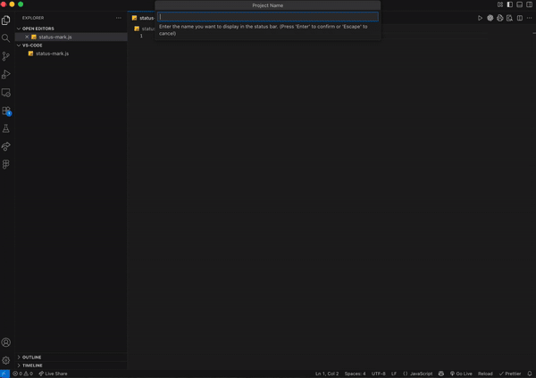

# StatusMark for VS Code

> Identify your workspaces with custom titles, emojis, and colors

[](https://marketplace.visualstudio.com/items?itemName=mig-code.statusmark)
[](https://marketplace.visualstudio.com/items?itemName=mig-code.statusmark)
[](https://marketplace.visualstudio.com/items?itemName=mig-code.statusmark)
[](https://opensource.org/licenses/MIT)

Make your VS Code workspace instantly recognizable! StatusMark lets you add a custom name, emoji, and color to your status bar, perfect for quickly identifying projects when working with multiple VS Code windows.



## ✨ Features

- **🎨 Custom Label** - Add a project name and emoji to your status bar
- **🌈 Colorful Status Bar** - Change your status bar background color per workspace
- **⚡ Live Preview** - See changes in real-time as you configure
- **🎯 Smart Colors** - Automatic contrast adjustment for readability
- **🎨 Color Palettes** - Choose from curated colors or enter your own hex values
- **😊 Emoji Library** - 17 preset emojis or use any custom emoji
- **💾 Per-Workspace** - Each project keeps its own settings
- **🔄 Easy Reset** - One command to restore defaults

## 🚀 Getting Started

### Installation

1. Open VS Code
2. Press `Ctrl+P` / `Cmd+P`
3. Type: `ext install mig-code.statusmark`
4. Press Enter

Or search for "StatusMark" in the Extensions view (`Ctrl+Shift+X` / `Cmd+Shift+X`).

### Quick Setup

1. Open the Command Palette (`Ctrl+Shift+P` / `Cmd+Shift+P`)
2. Type `StatusMark: Configure`
3. Follow the prompts:
   - Enter your project name
   - Choose an emoji (or enter custom)
   - Pick badge text color
   - Select status bar background color
4. Done! Your badge appears in the status bar

## 📖 Usage

### Commands

Open the Command Palette (`Ctrl+Shift+P` / `Cmd+Shift+P`) and type:

| Command | Description |
|---------|-------------|
| `StatusMark: Configure` | Complete setup wizard for label and status bar |
| `StatusMark: Configure Status Bar Color` | Quick status bar color adjustment |
| `StatusMark: Reset Workspace Settings` | Reset all settings to defaults |

## 🎨 Color Palettes

### Badge Text Colors
- Pure White, Pure Black
- Sunset Orange, Crimson
- Tropical Teal, Sky Blue
- Amethyst, Rose Pink
- Electric Cyan, Golden Glow
- **Theme Default** (uses your theme's color)
- **Custom** (enter any hex color)

### Status Bar Background Colors
- Cobalt Blue, Emerald Mist
- Azure Pulse, Amber Flame
- Rose Inferno, Violet Storm
- Teal Abyss, Slate Titanium
- **Theme Default** (restores theme color)
- **Custom** (enter any hex color)

## 😊 Preset Emojis

🚀 Rocket • ❤️ Heart • ✨ Sparkles • 🔥 Fire • 🌟 Star • 💎 Gem • 🎯 Target • 🧠 Brain • 🛠️ Tools • 🧪 Test Tube • 📦 Package • 📁 Folder • ✅ Check • ☕ Coffee • 🌈 Rainbow • 🎉 Party

Or use any emoji you like!

## 🔧 Advanced

### Manual Configuration

Settings are stored per workspace in `.vscode/settings.json`:

```json
{
  "statusmark.name": "Frontend",
  "statusmark.emoji": "⚛️",
  "statusmark.color": "#61DAFB"
}
```

Status bar colors are stored in:

```json
{
  "workbench.colorCustomizations": {
    "statusBar.background": "#1E3A8A",
    "statusBar.foreground": "#FFFFFF"
  }
}
```

### Global vs Workspace

This extension uses **workspace-level settings** by default, so each project can have its own label. If you want the same label across all projects, you can set it globally in User Settings.

## 💡 Use Cases

- **Multiple Projects**: Quickly identify which VS Code window is which
- **Client Work**: Color-code projects by client
- **Environments**: Distinguish dev, staging, and production
- **Team Collaboration**: Standardize project identifiers
- **Personal Organization**: Use emojis to categorize project types

## 🐛 Known Issues

None at the moment! [Report issues on GitHub](https://github.com/mig-code/status-mark/issues).

## 🤝 Contributing

Contributions are welcome! Please feel free to submit a Pull Request.

1. Fork the repository
2. Create your feature branch (`git checkout -b feature/AmazingFeature`)
3. Commit your changes (`git commit -m 'Add some AmazingFeature'`)
4. Push to the branch (`git push origin feature/AmazingFeature`)
5. Open a Pull Request

## 📝 Release Notes

See [CHANGELOG.md](CHANGELOG.md) for a detailed list of changes.

### 1.0.0 (2025-11-04)

Initial release with:
- Custom project labels with name and emoji
- Status bar color customization
- Live preview during configuration
- Curated color palettes
- Workspace-level persistence

## 📄 License

This extension is licensed under the [MIT License](LICENSE).

## 🙏 Acknowledgments

Built with ❤️ for the VS Code community.

---

## 🛠️ Development

Steps to run the extension in development:

1. `npm install`
2. `npm run watch`
3. Press F5 in VS Code to open a new window with the extension loaded
4. Run the `StatusMark: Configure` command and test the features

---

**Enjoy!** If you find this extension useful, please consider:
- ⭐ [Starring the repo on GitHub](https://github.com/mig-code/status-mark)
- 📝 Leaving a review on the Marketplace
- 🐛 [Reporting issues or suggesting features](https://github.com/mig-code/status-mark/issues)
